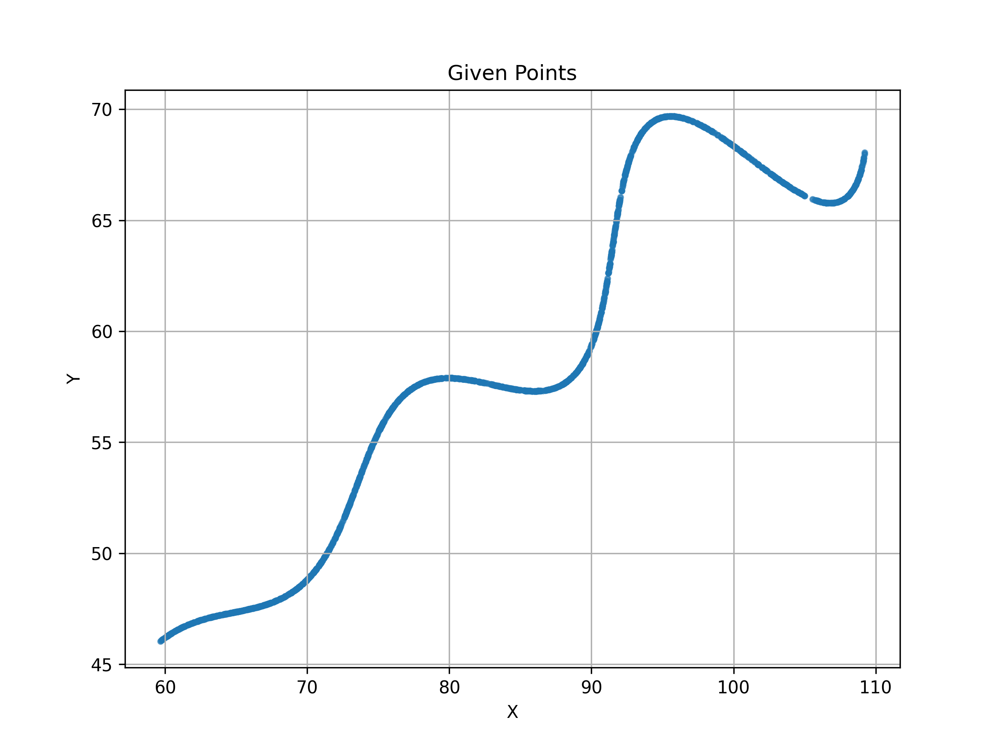
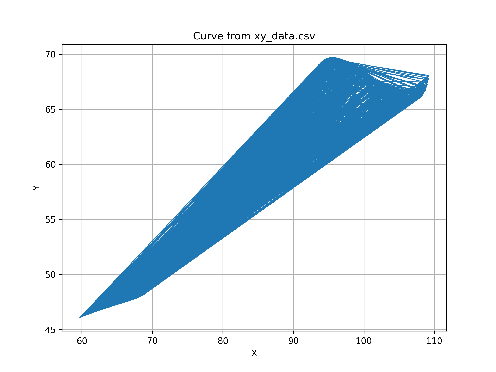
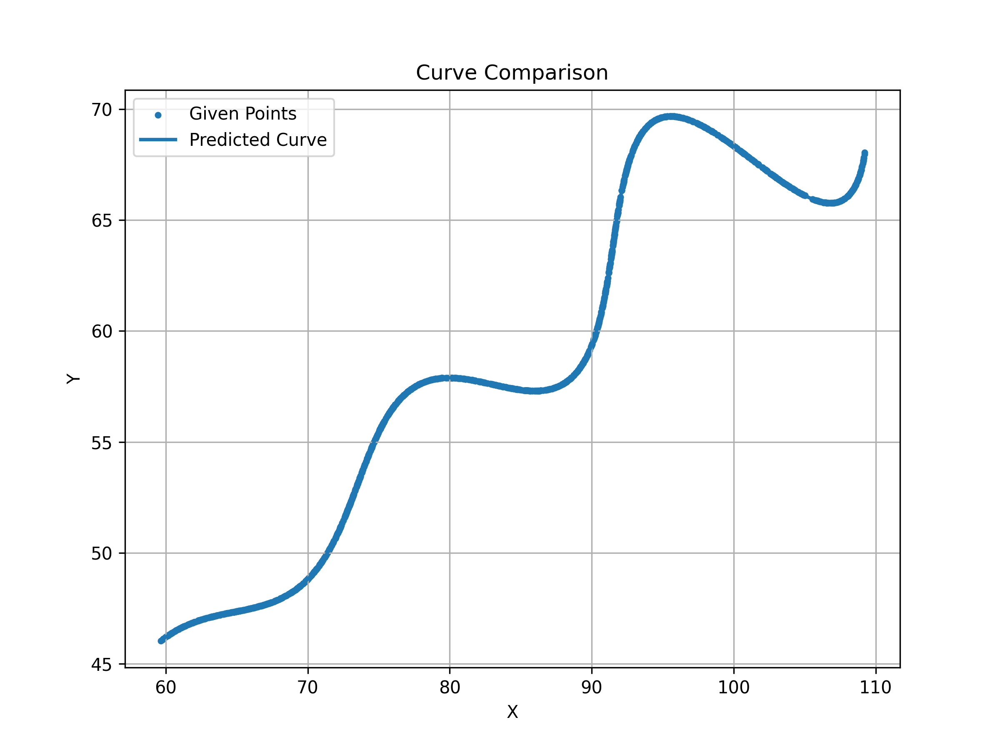

# AI R&D Assignment – Parametric Curve Estimation

## Student Details

**Name:** Lalithkishore J  
**Repository:** AI-RnD-Parametric-Curve-Estimation


# Objective

The objective of this assignment was to estimate the unknown parameters of a given parametric curve using the provided dataset. Instead of manually guessing the values of the parameters, the goal was to automatically determine the values that generate a curve almost identical to the original one. The unknown variables were Theta (θ), M, and X Shift. After estimating these parameters, the generated curve was compared against the original dataset to verify the accuracy of the solution.

This assignment combines concepts from mathematics, optimization, data visualization, and Python programming to solve a practical parameter estimation problem.

# Given Parametric Equation

## Given Parametric Equations

The parametric curve provided in the assignment is:

```text
x(t) = t cos(θ) - e^(M|t|) sin(0.3t) sin(θ) + X

y(t) = 42 + t sin(θ) + e^(M|t|) sin(0.3t) cos(θ)
```

### Parameter Range

```text
6 ≤ t ≤ 60

0° < θ < 50°

-0.05 < M < 0.05

0 < X < 100
```

Where:

- **θ** → Rotation angle (unknown)
- **M** → Exponential growth parameter (unknown)
- **X** → Horizontal shift (unknown)
- **t** → Curve parameter

The objective of this assignment is to estimate the unknown values of **θ**, **M**, and **X** such that the generated curve closely matches the given dataset while minimizing the L1 error.


# Thought Process

When I first looked at the assignment, my initial idea was to manually adjust the parameters and check whether the generated curve matched the dataset. However, I quickly realized that this approach would be inefficient because even a small change in Theta or M significantly changes the overall shape of the curve.

Instead of trial and error, I decided to formulate the problem as an optimization task. The optimizer would repeatedly generate curves using different parameter values, compare them with the original dataset, compute an error value, and continue searching until the error became as small as possible.

This approach is more systematic, reproducible, and closer to how similar problems are solved in engineering and machine learning applications.

# Complete Workflow

## Step 1 – Reading the Dataset

The first task was to inspect the provided CSV dataset. I loaded the file using the Pandas library and verified that it contained the expected X and Y coordinates. I also checked the number of data points, the data types of each column, and basic statistics such as minimum, maximum, mean, and standard deviation.

Performing this inspection helped ensure that the dataset was read correctly and there were no missing values or formatting issues before proceeding to later stages.

## Step 2 – Visualizing the Dataset

Before implementing any optimization algorithm, I plotted the input data to understand the overall curve shape visually.

Initially, I plotted the points using a continuous line. However, I observed that the dataset was not perfectly ordered, which sometimes produced unwanted connecting lines. Therefore, I also visualized the data as scatter points, which gave a much clearer understanding of the actual distribution of points.

This visualization step helped me confirm that the curve followed the expected parametric pattern before moving on to mathematical modeling.

### Input Dataset Visualization

The figure below shows the input dataset loaded from the CSV file. Plotting the points helped me understand the overall shape of the curve before implementing the optimization algorithm.



## Step 3 – Implementing the Mathematical Model

Next I implemented the given parametric equations in Python.

The model generates X and Y coordinates using:

- theta
- M
- X shift

Initially I used manually selected parameter values only to verify that my implementation of the equations was correct.

Once the generated curve looked reasonable, I proceeded to optimization.

### Initial Generated Curve

Before starting optimization, I generated a curve using manually selected parameter values. This was done only to verify that the mathematical equations were implemented correctly.



## Step 4 – Error Function

To evaluate how well the generated curve matched the original dataset, an error function was required.

I used the L1 error (Mean Absolute Error style comparison), which calculates the absolute difference between the generated curve and the original points.

The optimization process attempts to minimize this error. As the error decreases, the generated curve becomes increasingly similar to the dataset.

Using an objective error function makes the comparison numerical instead of relying only on visual inspection.

## Step 5 – Parameter Optimization

The optimization problem has three unknown variables.

- Theta
- M
- X Shift

Instead of manually tuning these values, I used SciPy's optimization module.

The optimizer repeatedly:

- generated a curve
- computed the error
- updated the parameters
- repeated until the minimum error was found

This process automatically estimated the unknown parameters.


## Step 6 – Comparing the Curves

Once the optimization finished, the estimated parameters were printed on the console.

Using these parameters, the curve was generated once again and plotted together with the original dataset.

The comparison graph clearly showed that both curves almost completely overlap. This confirmed that the optimization algorithm had successfully estimated the unknown parameters.

The final L1 error was extremely small, indicating that the generated curve is a very close approximation of the original dataset.

### Final Curve Comparison

The figure below compares the original dataset with the optimized curve. The overlap between both curves indicates that the estimated parameters closely match the original curve.

The optimized curve is plotted together with the original dataset for verification. Due to the very small L1 error (0.021239), the predicted curve almost exactly overlaps the given points. The overlap demonstrates that the estimated parameters accurately reconstruct the original parametric curve. Therefore, the appearance of a single curve is expected and indicates a successful optimization.



Note: The original data points are hidden beneath the predicted curve because both curves overlap almost perfectly after optimization (L1 Error = 0.021239).
## Step 7 – Saving Results

The final outputs are automatically saved.

Generated files include:

- **input_points.png** – Scatter plot of the original dataset loaded from `xy_data.csv`. This was used to inspect the shape and distribution of the given points before implementing the optimization.

- **input_curve.png** – Curve generated using manually selected parameter values. This helped verify that the mathematical model and parametric equations were implemented correctly before starting optimization.

- **final_curve.png** – Comparison of the optimized parametric curve with the original dataset. The almost complete overlap between the two curves confirms that the estimated parameters accurately reconstruct the given curve.

- **parameters.txt** – Stores the final estimated values of **θ**, **M**, **X Shift**, and the corresponding **L1 error**, making it easy to reproduce and verify the results without rerunning the optimization.

This makes it easy to verify the results without rerunning the optimization.


# Challenges Faced

While working on this assignment, I encountered several practical issues.

Initially, I had problems configuring GitHub because the remote repository was not linked correctly. After creating the repository and setting the remote origin, I successfully pushed the project.

Another challenge was understanding how the dataset should be compared with the generated curve. My first implementation compared points directly based on their indices, but this was not sufficiently accurate because the dataset ordering did not perfectly correspond to the generated points.

I also spent some time tuning the optimization settings and parameter bounds. Poor initial values caused slower convergence, while better bounds significantly improved the optimization process.

Finally, formatting the final equation for Desmos required additional effort because Desmos uses a different syntax from Python. After correcting the expressions and restricting the parameter domain, I was able to successfully visualize the final curve in Desmos.

# Final Estimated Parameters

| Parameter | Estimated Value |
|-----------|----------------:|
| Theta (degrees) | 29.999890 |
| Theta (radians) | 0.523597 |
| M | 0.030000 |
| X Shift | 54.999606 |
| L1 Error | 0.021239 |

# Final Parametric Equation

```
x(t)=t*cos(0.523597)-exp(0.03*abs(t))*sin(0.3*t)*sin(0.523597)+54.999606

y(t)=42+t*sin(0.523597)+exp(0.03*abs(t))*sin(0.3*t)*cos(0.523597)

6 ≤ t ≤ 60
```


# Desmos Link

https://www.desmos.com/calculator/q2lld6mfsm


# Project Structure

```
data/
    xy_data.csv

results/
    final_curve.png
    input_curve.png
    input_points.png
    parameters.txt

src/
    data_loader.py
    model.py
    optimizer.py
    plots.py
    evaluation.py
    save_results.py
    utils.py

main.py
README.md
```


# Libraries Used

- Python
- NumPy
- Pandas
- Matplotlib
- SciPy

## Overall Workflow
```text
Load Dataset
      │
      ▼
Visualize Dataset
      │
      ▼
Implement Parametric Model
      │
      ▼
Define L1 Error Function
      │
      ▼
Estimate Parameters using Optimization
      │
      ▼
Generate Final Curve
      │
      ▼
Compare with Original Curve
      │
      ▼
Save Results
```

# Conclusion

This assignment gave me practical experience in solving an optimization problem rather than simply implementing mathematical equations.

I learned how mathematical models can be translated into Python, how optimization algorithms search for unknown variables, and how visualization helps verify the correctness of the implementation.

The final estimated parameters produced an almost perfect overlap with the original curve, resulting in a very small L1 error of **0.021239**.